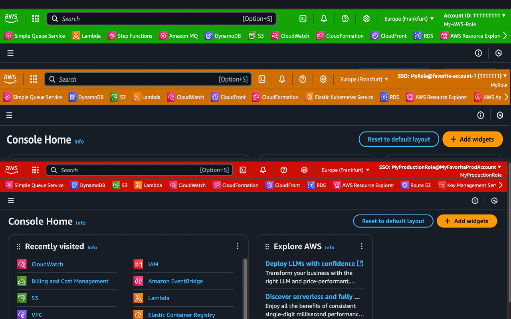
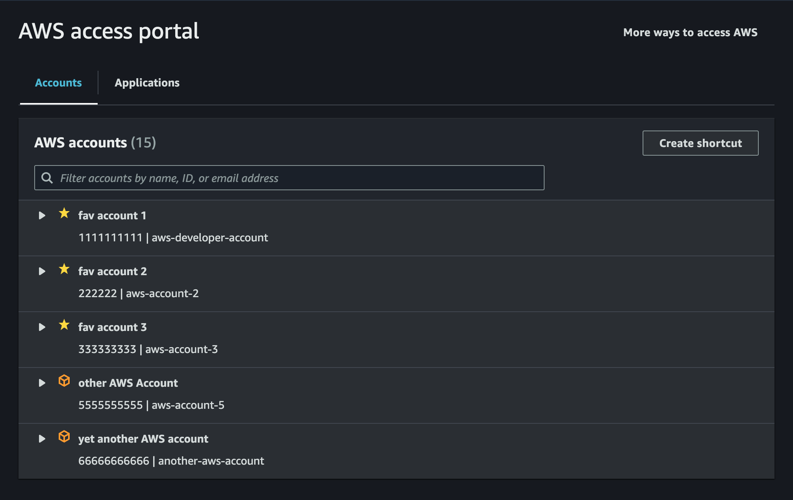

# Google Chrome Extension for AWS SSO

This extenstion is available in the [Chrome Web Store](https://chromewebstore.google.com/detail/aws-sso-and-session-manag/kghkflhhfjghenhbfegapaeaiobjomno).

This extension is for AWS IAM Identity Center, formerly known as AWS Single Sign-On and the usage of multiple AWS accounts. 
It enriches the AWS Web Console visually.

This extension is a fork of an extension that seems not to be maintened any longer. 
[chrome-extension-awssso](https://github.com/yaggytter/chrome-extension-awssso) by [yaggytter](https://github.com/yaggytter)

This extension is providing following functions: 
<ul>
<li>
Displaying the account name and permission set for the current console at the AWS console's header.
</li>
<li>
Changing the header color to a configurable color if the account name matches a certain pattern (e.g. contains 'Production' it will color red).
</li>
<li>
Brings favorite accounts to the top on the SSO login page and mark it visually.
</li>
</ul>

## How to use

You just add this extension from [chrome web store](https://chromewebstore.google.com/detail/aws-sso-and-session-manag/kghkflhhfjghenhbfegapaeaiobjomno).
You can also contribute to add your functions to this.
